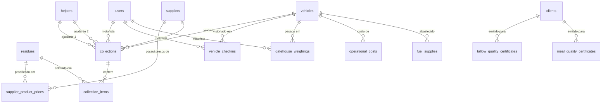

# 🏭 Planejamento de Adequação de Regras de Negócio
## De: [Cabraforte](file:///C:/xampp/htdocs/cabraforte) (Legado PHP) 
## Para: [Graxaria](file:///C:/xampp/htdocs/graxaria) (Laravel 11.x & Filament PHP v3)

Este documento apresenta a análise de regras de negócios e o mapeamento técnico necessário para migrar e integrar as funcionalidades e controles operacionais do sistema legado **Cabraforte** no sistema moderno **graxaria** (baseado em Laravel e Filament).

---

## 1. Visão Geral Comparativa dos Sistemas

### [Sistema Cabraforte](file:///C:/xampp/htdocs/cabraforte) (Origem)
*   **Aparência/Tecnologia:** PHP estruturado/legado com consultas diretas via MySQLi e PDO.
*   **Grau de Controle Operacional:** Altamente especializado para a rotina diária de uma indústria de graxaria e logística de coleta. Possui controles avançados de pesagem de caminhões (portaria/balancão), vistorias de segurança (check-in/check-out), consumo de combustível por quilômetro rodado, rateio de custos de manutenção de veículos por categoria de despesa, controle de comissões segmentado por rota/produto, controle de estoque de peças físicas (almoxarifado), e geração de laudos de qualidade química e física sob as normas do SIF (Serviço de Inspeção Federal) / PAC (Programa de Autocontrole).

### [Sistema Graxaria](file:///C:/xampp/htdocs/graxaria) (Destino)
*   **Aparência/Tecnologia:** Laravel 11.x, Filament PHP v3 (Livewire, Alpine.js, Tailwind CSS), Spatie Laravel Permission (Filament Shield) e Eloquent ORM.
*   **Grau de Controle Operacional:** Atualmente simplificado. Possui apenas cadastros básicos de coletas unidimensionais (um único peso e tipo de resíduo por coleta), precificação estática única por fornecedor, e um controle simples de processamento de lotes e vendas de subprodutos. Não contempla controle de veículos, viagens detalhadas, custos operacionais, almoxarifado, controle de qualidade (PAC) ou comissões complexas.

---

## 2. Análise de Lacunas (Gap Analysis) e Mapeamento de Regras de Negócio

Para que o sistema **graxaria** atenda plenamente às operações atuais, as seguintes lacunas de negócios do **Cabraforte** precisam ser supridas:

### A. Coletas Multi-Item vs. Coletas Planas
*   **Regra de Negócio Cabraforte:** Uma viagem de coleta a um fornecedor pode recolher múltiplos tipos de resíduos (ex: Osso, Sebo, Gordura, Miúdos) com pesos e valores unitários diferentes. Isso é estruturado de forma mestre-detalhe na tabela `coletas` e `coletas_detalhes` (geridas pela classe [Coletas](file:///C:/xampp/htdocs/cabraforte/controller/model/model_coleta.php#L13)).
*   **Estrutura Atual no Graxaria:** A migração [2026_07_07_122208_create_collections_table.php](file:///C:/xampp/htdocs/graxaria/database/migrations/2026_07_07_122208_create_collections_table.php) define uma tabela plana `collections` com apenas um peso (`weight`), um preço por kg (`price_per_kg`) e um tipo de resíduo (`residue_type`). Isso impede o registro de coletas mistas em uma mesma viagem.
*   **Ação Necessária:** Reformular a tabela de coletas criando a relação mestre-detalhe no Laravel com `Collection` e `CollectionItem` e usar componentes do tipo `Repeater` no Filament Resource de coletas.

### B. Tabela de Insumos e Preços Dinâmicos por Fornecedor
*   **Regra de Negócio Cabraforte:** O sistema possui um cadastro geral de `insumos` (classe [Insumos](file:///C:/xampp/htdocs/cabraforte/controller/model/model_insumo.php#L7)). Para cada fornecedor, o usuário associa os insumos que ele fornece como `produtos` (classe [Fornecedores](file:///C:/xampp/htdocs/cabraforte/controller/model/model_produto.php#L7)), definindo preços de compra específicos (`vl_produto`), permitindo assim flexibilidade nas cotações.
*   **Estrutura Atual no Graxaria:** A tabela `suppliers` (definida na migração [2026_07_07_122207_create_suppliers_table.php](file:///C:/xampp/htdocs/graxaria/database/migrations/2026_07_07_122207_create_suppliers_table.php)) tem apenas uma coluna global `price_per_kg`, impossibilitando precificar resíduos diferentes para o mesmo fornecedor.
*   **Ação Necessária:** Criar os models `Residue` (substituindo o enum estático de tipos de resíduos) e `SupplierProductPrice` (intermediária entre `Supplier` e `Residue` para registrar o preço acordado por KG).

### C. Logística de Frota (Veículos, Terceirizados e Ajudantes)
*   **Regra de Negócio Cabraforte:** Cadastra veículos próprios de frota (`veiculo`, gerido em [Veiculos](file:///C:/xampp/htdocs/cabraforte/controller/model/model_veiculo.php#L6)) e veículos terceirizados (`terceirizado`) pertencentes a proprietários autônomos. Também gerencia a equipe de auxiliares (`ajudantes`) envolvidos na carga física das bombonas e calcula comissões específicas por viagem para motorista, ajudante 1 e ajudante 2.
*   **Estrutura Atual no Graxaria:** Motoristas e placas são salvos apenas como strings de texto livre (`driver_name` e `vehicle_plate`) diretamente em `collections`.
*   **Ação Necessária:** Criar as entidades `Vehicle`, `Helper`, e `OutsourcedVehicle` com chaves estrangeiras apropriadas em `collections`.

### D. Processo de Check-in e Check-out do Motorista (Controle de Viagens)
*   **Regra de Negócio Cabraforte:** O motorista inicia o dia com um formulário de Check-in (`tblcheckin`), onde deve marcar as condições de segurança do caminhão (freios, pneus, luzes, nivel de óleo, etc.), registrando a rota atribuída, o odômetro inicial e os ajudantes vinculados. No retorno à fábrica, realiza o Check-out (`tblcheckout`), atualizando o odômetro final (usado no cálculo de quilometragem e consumo) e registrando a quilometragem para troca de óleo (`tbltrocaoleo`).
*   **Estrutura Atual no Graxaria:** Não há controle de status de viagens ou checklists de veículos.
*   **Ação Necessária:** Criar o model `VehicleCheckin` e associar ao fluxo de trabalho operacional no Filament.

### E. Balancão (Controle de Portaria e Viagens)
*   **Regra de Negócio Cabraforte:** Na entrada e saída da fábrica, os caminhões são pesados na balança rodoviária física. Esses dados são salvos em `tblportaria` e `tblviagens` (gerido por [ModelBalancao](file:///C:/xampp/htdocs/cabraforte/controller/model/model_balancao.php#L10)). O peso líquido da balança é confrontado com a soma das coletas parciais declaradas em campo pelo motorista para identificar desvios/perdas de matéria-prima durante o transporte.
*   **Estrutura Atual no Graxaria:** Inexistente.
*   **Ação Necessária:** Implementar o model `GatehouseWeighing` (Pesagem de Portaria) e criar uma tela Filament dedicada para a portaria da fábrica.

### F. Custos, Despesas e Abastecimento de Combustível
*   **Regra de Negócio Cabraforte:** Registra custos e despesas operacionais (`custos`, gerido por [Custos](file:///C:/xampp/htdocs/cabraforte/controller/model/model_custo.php#L6)), divididos em categorias de manutenção, pneus, peças, etc., associando cada despesa ao motorista e ao veículo correspondente. Controla também os abastecimentos (`abastecimento`, gerido por [Abastecimento](file:///C:/xampp/htdocs/cabraforte/controller/model/model_abastecimento.php#L8)), registrando postos credenciados (`prestador_servico`), quantidade de litros, preço por litro e odômetro do veículo para gerar a média de consumo ($km/L$).
*   **Estrutura Atual no Graxaria:** Inexistente.
*   **Ação Necessária:** Criar as entidades `CostCategory`, `OperationalCost`, `ServiceProvider` e `FuelSupply`.

### G. Controle de Estoque de Autopeças (Almoxarifado)
*   **Regra de Negócio Cabraforte:** Integrado com a oficina mecânica interna. Permite dar entradas de peças no estoque (`estoque`, classe [Estoque](file:///C:/xampp/htdocs/cabraforte/controller/model/model_estoque.php#L6)) com notas fiscais. Ao cadastrar um custo de manutenção del tipo "peças", o sistema baixa automaticamente o item correspondente do almoxarifado.
*   **Estrutura Atual no Graxaria:** Inexistente.
*   **Ação Necessária:** Criar tabelas de `InventoryItem` e `InventoryTransaction`.

### H. Emissão de Certificados de Qualidade PAC (SIF) - Sebo e Farinha
*   **Regra de Negócio Cabraforte:** Por exigência sanitária do Ministério da Agricultura (SIF), cargas de Sebo e Farinha de Carne e Ossos não podem sair da fábrica sem laudos químicos. O sistema possui tabelas específicas (`laudo_sebo` e `tblespfarinha`) para registrar análises laboratoriais (Aspecto, Ácidos Graxos Livres/Acidez, Impurezas, Odor, Umidade, Temperatura de Expedição) e a vistoria de conformidade higiênica do caminhão transportador (lona de cobertura, ausência de umidade interna, lacres da empresa, etc.).
*   **Estrutura Atual no Graxaria:** Não há controle ou emissão de laudos de laboratório/expedição.
*   **Ação Necessária:** Criar tabelas de `TallowQualityCertificate` e `MealQualityCertificate` integradas com o fluxo de vendas (`sales`).

---

## 3. Modelo de Dados Proposto (Novas Tabelas e Relacionamentos)

Abaixo está a modelagem sugerida em notação do banco de dados relacional para estender o banco de dados do **graxaria** para comportar as regras do **Cabraforte**:



### Novas Tabelas e Campos Sugeridos (Laravel Migrations)

#### 1. Insumos / Tipos de Resíduos (`residues`)
Substitui enums estáticos na coleta.
*   `id` (PK)
*   `name` (Ex: *Ossos, Gordura, Miúdos, Pele*)
*   `is_active` (boolean)

#### 2. Preços Personalizados por Fornecedor (`supplier_product_prices`)
Associa cada fornecedor aos insumos que ele fornece e o preço individual por KG.
*   `id` (PK)
*   `supplier_id` (FK -> `suppliers`)
*   `residue_id` (FK -> `residues`)
*   `price_per_kg` (decimal 8,2)

#### 3. Veículos da Frota (`vehicles`)
Armazena a frota da empresa e carros terceirizados.
*   `id` (PK)
*   `plate` (string, única)
*   `dut` (string, opcional)
*   `renavan` (string, opcional)
*   `brand_model` (string)
*   `color` (string)
*   `year_fabrication` (integer)
*   `year_model` (integer)
*   `is_outsourced` (boolean)
*   `owner_name` (string, opcional - se terceirizado)
*   `owner_phone` (string, opcional)
*   `driver_user_id` (FK opcional -> `users`)
*   `status` (enum: *Ativo, Manutenção, Inativo*)

#### 4. Auxiliares / Ajudantes (`helpers`)
Cadastro de ajudantes de carregamento.
*   `id` (PK)
*   `name` (string)
*   `phone` (string)
*   `is_active` (boolean)

#### 5. Modificações em Coletas (`collections`)
Para relacionar com veículos, motoristas e ajudantes.
*   `id` (PK)
*   `supplier_id` (FK -> `suppliers`)
*   `collection_date` (dateTime)
*   `driver_user_id` (FK -> `users`)
*   `vehicle_id` (FK -> `vehicles`)
*   `helper_id` (FK opcional -> `helpers`)
*   `helper_2_id` (FK opcional -> `helpers`)
*   `status` (enum: *Agendada, Coletada, Cancelada*)
*   `batch_id` (FK opcional -> `batches`)

#### 6. Itens de Coleta (`collection_items`)
Armazena os detalhes dos materiais recolhidos na viagem de coleta (Multi-item).
*   `id` (PK)
*   `collection_id` (FK -> `collections`)
*   `residue_id` (FK -> `residues`)
*   `weight` (decimal 10,2)
*   `price_per_kg` (decimal 8,2)
*   `total_cost` (decimal 10,2)

#### 7. Vistoria / Check-in de Viagens (`vehicle_checkins`)
Checklist obrigatório de pré-viagem de frota.
*   `id` (PK)
*   `vehicle_id` (FK -> `vehicles`)
*   `driver_user_id` (FK -> `users`)
*   `helper_id` (FK -> `helpers`)
*   `helper_2_id` (FK opcional -> `helpers`)
*   `odometer_start` (integer)
*   `odometer_end` (integer, opcional - inserido no checkout)
*   `check_tires` (boolean)
*   `check_brakes` (boolean)
*   `check_lights` (boolean)
*   `check_oil` (boolean)
*   `check_wipers` (boolean)
*   `num_drums` (integer, padrão 0)
*   `is_impeditivo` (boolean, impede saída do veículo se apresentar problemas sérios)
*   `obs` (text, opcional)
*   `check_date` (date)
*   `checkout_date` (dateTime, opcional)

#### 8. Pesagem de Portaria (`gatehouse_weighings`)
*   `id` (PK)
*   `vehicle_id` (FK -> `vehicles`)
*   `driver_user_id` (FK -> `users`)
*   `gross_weight` (decimal 10,2 - Peso Bruto de entrada)
*   `tare_weight` (decimal 10,2 - Peso da tara do caminhão na saída)
*   `net_weight` (decimal 10,2 - Peso Líquido real descarregado)
*   `trip_number` (integer - número da viagem do motorista no dia)
*   `weighing_date` (dateTime)
*   `status` (enum: *Pendente_Tara, Concluído, Cancelado*)

#### 9. Despesas Operacionais (`operational_costs`)
*   `id` (PK)
*   `vehicle_id` (FK -> `vehicles`)
*   `driver_user_id` (FK -> `users`)
*   `cost_category_id` (FK -> `cost_categories` - manutenção, pneus, lubrificantes, outros)
*   `description` (string)
*   `value` (decimal 10,2)
*   `invoice_number` (string, opcional)
*   `cost_date` (date)

#### 10. Abastecimento de Combustível (`fuel_supplies`)
*   `id` (PK)
*   `vehicle_id` (FK -> `vehicles`)
*   `driver_user_id` (FK -> `users`)
*   `liters` (decimal 8,2)
*   `price_per_liter` (decimal 8,4)
*   `total_value` (decimal 10,2)
*   `odometer` (integer)
*   `coupon_number` (string)
*   `fuel_type` (string: *Diesel S10, Diesel Comum, Outros*)
*   `supply_date` (date)

#### 11. Certificado de Análise de Sebo (`tallow_quality_certificates`)
Controle sanitário e laboratório de Sebo.
*   `id` (PK)
*   `sale_id` (FK -> `sales`)
*   `client_id` (FK -> `clients`)
*   `analysis_date` (date)
*   `shipping_date` (date)
*   `production_date` (string)
*   `expiry_info` (string)
*   `result_aspect` (string)
*   `result_acidity` (string)
*   `result_impurities` (string)
*   `result_odor` (string)
*   `result_moisture` (string)
*   `vehicle_plate` (string)
*   `carrier_name` (string)
*   `invoice_number` (string)
*   `seal_number` (string)
*   `inspected_clean_external` (boolean)
*   `inspected_clean_internal` (boolean)
*   `inspected_dry_internal` (boolean)
*   `is_released` (boolean)
*   `qa_responsible` (string)
*   `technical_responsible` (string)

#### 12. Certificado de Análise de Farinha (`meal_quality_certificates`)
Controle sanitário e laboratório de Farinha de Carne e Ossos.
*   `id` (PK)
*   `sale_id` (FK -> `sales`)
*   `client_id` (FK -> `clients`)
*   `analysis_date` (date)
*   `revisao_number` (integer)
*   `invoice_number` (string)
*   `weight` (decimal 10,2)
*   `vehicle_plate` (string)
*   `driver_name` (string)
*   `driver_cpf` (string)
*   `seal_number` (string)
*   `non_conformities` (text, opcional)
*   `corrective_actions` (text, opcional)
*   `verification` (text, opcional)

---

## 4. Plano de Ação de 4 Fases para Adequação

Para garantir uma transição suave e estável, o desenvolvimento no **graxaria** deve ser dividido em etapas prioritárias:

### 📅 Fase 1: Núcleo de Coletas e Preços Dinâmicos (Alta Prioridade)
1.  **Criar Migrations & Models:**
    *   Tabela `residues` (Insumos globais).
    *   Tabela `supplier_product_prices` (Lista de preços de insumos por fornecedor).
    *   Tabela `collection_items` (Itens de coleta para quebrar a coleta mestre-detalhe).
2.  **Filament Resources:**
    *   Criar o recurso `ResidueResource`.
    *   Adicionar um `RelationManager` de preços dentro do `SupplierResource` para que o usuário possa associar insumos e seus preços dinâmicos por KG na própria tela do fornecedor.
    *   Alterar o formulário em `CollectionResource` para utilizar o componente `Repeater` contendo os campos de produto (insumo), peso e preço por kg.
3.  **Lógica Livewire (Preenchimento Automático):**
    *   Implementar a lógica na tela de coleta que busca os preços cadastrados para aquele fornecedor ao selecionar o insumo no `Repeater`, multiplicando dinamicamente pelo peso inserido para gerar o `total_cost`.

### 🚛 Fase 2: Gestão de Frota, Viagens e Ajudantes
1.  **Criar Migrations & Models:**
    *   Tabela `vehicles` e tabela `helpers`.
    *   Tabela `vehicle_checkins` (Check-in e Check-out).
2.  **Filament Resources:**
    *   Criar o recurso `VehicleResource` e `HelperResource`.
    *   Criar o recurso `VehicleCheckinResource`.
3.  **Lógicas Operacionais:**
    *   No formulário de Check-in, ao selecionar o veículo, carregar o último odômetro final registrado para sugerir como odômetro inicial.
    *   Integrar os campos de `driver_user_id`, `vehicle_id` e ajudantes nas coletas.

### ⚖️ Fase 3: Balancão de Portaria, Custos e Comissões
1.  **Criar Migrations & Models:**
    *   Tabela `gatehouse_weighings` (Pesagens de Portaria).
    *   Tabela `operational_costs` (Despesas).
    *   Tabela `fuel_supplies` (Abastecimento de Combustível).
    *   Tabela `route_commission_parameters` (Parâmetros de comissão por Rota/Produto).
2.  **Filament Resources:**
    *   Criar `GatehouseWeighingResource` (painel simplificado para operador de balança registrar Pesos Brutos, Taras e obter o Peso Líquido).
    *   Criar `OperationalCostResource` e `FuelSupplyResource`.
3.  **Regras e Dashboards:**
    *   Criar rotinas que comparam o Peso Líquido da Balança com a soma total dos pesos de coletas do motorista no mesmo dia/viagem.
    *   Criar rotina de cálculo de consumo de combustível ($km/L$) baseado no histórico de odômetros de abastecimento.
    *   Calcular comissões de viagens com base nos pesos registrados.

### 🧪 Fase 4: Almoxarifado e Certificados de Qualidade PAC (SIF)
1.  **Criar Migrations & Models:**
    *   Tabela `inventory_items` e `inventory_transactions` (Estoque básico).
    *   Tabela `tallow_quality_certificates` (Laudo Sebo).
    *   Tabela `meal_quality_certificates` (Laudo Farinha).
2.  **Recursos e Emissão de PDFs:**
    *   Criar os laudos vinculados a vendas.
    *   Implementar ação customizada no Filament Resource de Vendas (`SalesResource`) para "Gerar Certificado de Análise" abrindo um formulário com os campos de laboratório e exportando em PDF formatado para a fiscalização.
    *   Lógica no controle de despesas de mecânica para reduzir automaticamente o estoque do item selecionado.

---

## 5. Exemplo de Implementação no Filament PHP v3

Abaixo está um exemplo de como implementar a coleta multi-item no Filament PHP (`CollectionResource.php`), aproveitando os relacionamentos do Laravel para espelhar a lógica antiga de detalhes do Cabraforte:

```php
use Filament\Forms\Components\Select;
use Filament\Forms\Components\Repeater;
use Filament\Forms\Components\TextInput;
use Filament\Forms\Components\DateTimePicker;

public static function form(Form $form): Form
{
    return $form
        ->schema([
            Select::make('supplier_id')
                ->relationship('supplier', 'name')
                ->required()
                ->reactive()
                ->afterStateUpdated(fn ($state, callable $set) => $set('items', [])), // Limpa itens se fornecedor mudar
            
            DateTimePicker::make('collection_date')
                ->required()
                ->default(now()),
                
            Select::make('driver_user_id')
                ->relationship('driver', 'name')
                ->label('Motorista')
                ->required(),

            Select::make('vehicle_id')
                ->relationship('vehicle', 'plate')
                ->label('Veículo / Placa')
                ->required(),

            // Repeater que substitui a tabela detalhada do Cabraforte
            Repeater::make('items')
                ->relationship('items') // Relação HasMany no Model Collection
                ->schema([
                    Select::make('residue_id')
                        ->relationship('residue', 'name')
                        ->label('Resíduo')
                        ->required()
                        ->reactive()
                        ->afterStateUpdated(function ($state, callable $get, callable $set) {
                            $supplierId = $get('../../supplier_id');
                            if ($supplierId && $state) {
                                // Busca o preço padrão cadastrado para este fornecedor e resíduo
                                $price = \App\Models\SupplierProductPrice::where('supplier_id', $supplierId)
                                    ->where('residue_id', $state)
                                    ->value('price_per_kg') ?? 0.00;
                                $set('price_per_kg', $price);
                            }
                        }),
                    
                    TextInput::make('weight')
                        ->label('Peso (KG)')
                        ->numeric()
                        ->required()
                        ->reactive()
                        ->afterStateUpdated(function ($state, callable $get, callable $set) {
                            $price = $get('price_per_kg') ?? 0;
                            $set('total_cost', round($state * $price, 2));
                        }),

                    TextInput::make('price_per_kg')
                        ->label('Preço por KG (R$)')
                        ->numeric()
                        ->required()
                        ->reactive()
                        ->afterStateUpdated(function ($state, callable $get, callable $set) {
                            $weight = $get('weight') ?? 0;
                            $set('total_cost', round($weight * $state, 2));
                        }),

                    TextInput::make('total_cost')
                        ->label('Custo Total (R$)')
                        ->numeric()
                        ->readOnly()
                        ->required(),
                ])
                ->columns(4)
                ->label('Itens Coletados')
                ->createItemButtonLabel('Adicionar Resíduo'),
        ]);
}
```

Este plano consolida as regras de negócio operacionais, promovendo a modernização do ecossistema de software sem comprometer as validações rigorosas e exigências sanitárias e fiscais da fábrica.
