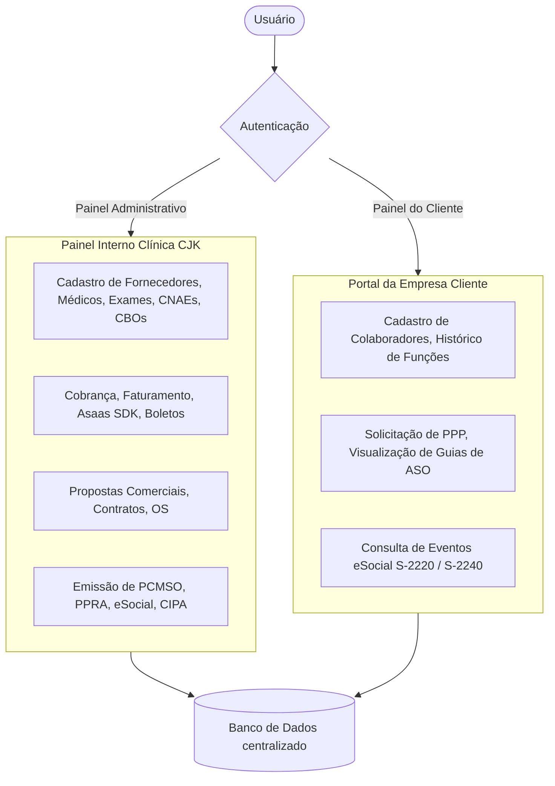

# 🏥 Planejamento de Reestruturação e Modernização - Clínica CJK
## Sistema: [clinicacjk.com.br](file:///c:/xampp/htdocs/clinicacjk.com.br)
## Proposta: Migração para Laravel 11.x, Filament PHP v3 e PHP 8.2+

Este documento apresenta o planejamento estratégico, a análise arquitetural e o mapeamento técnico necessário para migrar o sistema de gestão de saúde ocupacional da **Clínica CJK** para uma arquitetura moderna baseada em **Laravel 11.x**, **Filament PHP v3** (Livewire, Alpine.js, Tailwind CSS) e banco de dados relacional otimizado.

---

## 1. Análise Situacional do Sistema Atual (Legado)

Após a análise do diretório [clinicacjk.com.br](file:///c:/xampp/htdocs/clinicacjk.com.br), foram identificados os seguintes aspectos técnicos:

### A. Dependências e Infraestrutura Desatualizadas
*   **Versões Atuais:** O projeto está estruturado em Laravel 8.0, rodando sob a exigência do PHP 7.3 no `composer.json`.
*   **Incompatibilidade de Ambiente:** O servidor local (XAMPP) executa o **PHP 8.2.12**. Isso causa falhas de runtime e fatal errors em pacotes antigos de debug e tratamento de erros (ex: `facade/ignition`), impossibilitando o uso fluido do `artisan`.
*   **Front-End Acoplado:** O painel administrativo e os portais são construídos com Bootstrap 4, jQuery e Laravel Mix (Webpack), exigindo manutenção manual pesada de código Javascript para máscaras, validações AJAX e manipulação de DOM.

### B. Estrutura de Rotas e Controladores Redundante
*   **Segmentação Rígida por Perfis:** Há arquivos de rotas separados para cada cargo no diretório [routes/web/](file:///c:/xampp/htdocs/clinicacjk.com.br/routes/web) (ex: `diretoria-administrativa.php`, `operador-financeiro.php`, etc.).
*   **Multiplicação de Arquivos CRUD:** Há mais de 60 controladores que implementam operações básicas de CRUD (`index`, `create`, `store`, `edit`, `update`, `destroy`) de forma repetitiva para cada perfil de usuário. Por exemplo, existem controllers e views duplicadas/similares para Diretoria e Operador gerenciarem os mesmos recursos.
*   **Permissões Customizadas Acopladas:** O controle de acessos é baseado em tabelas customizadas (`permissoes_de_menus`, `permissoes_de_botoes` e `permissao_de_submenus`) integradas a um middleware `cargo`, dificultando auditorias e a escalabilidade de novas funções no sistema.

### C. Geração e Armazenamento de Guias (ASO, PPP, Exames)
*   **Escrita em Disco de Arquivos Estáticos:** Atualmente, a emissão de guias (ex: [GuiaDeAso.php](file:///c:/xampp/htdocs/clinicacjk.com.br/app/Http/Controllers/Admin/Dashboard/DiretoriaAdministrativa/GuiaDeAso.php#L92)) gera arquivos HTML estáticos salvos diretamente na pasta pública (`resources/views/documentos/guias-de-aso/`).
*   **Problemas dessa abordagem:** 
    *   Consumo excessivo e desordenado de armazenamento em disco.
    *   Falhas de segurança (documentos sensíveis expostos em pastas públicas/renderizáveis diretamente).
    *   Dificuldade de controle de versão dos laudos gerados.

---

## 2. Proposta de Reestruturação Arquitetural com Filament PHP v3

A migração para o Filament PHP v3 simplificará a base de código, eliminará código redundante e oferecerá uma interface extremamente premium para os usuários da clínica e seus clientes.



### A. Painéis Multi-Panel (Filament Panels)
Em vez de mantermos rotas e views separadas em diretórios físicos complexos, utilizaremos a funcionalidade nativa de múltiplos painéis do Filament:

1.  **`AdminPanel` (`/admin`):**
    *   Destinado a todos os colaboradores internos da Clínica CJK (Diretoria Administrativa, Comercial, Financeira, Técnica, e Operadores correspondentes).
    *   O controle de permissões e visibilidade de recursos será dinâmico por meio de Policies e **Spatie Laravel Permission** integrado ao **Filament Shield**.
2.  **`ClientPanel` (`/portal`):**
    *   Destinado aos contatos dos clientes da clínica (empresas parceiras).
    *   Permite a visualização de colaboradores ativos, solicitação de guias e downloads de laudos (PCMSO/PGR) autorizados para sua empresa (filtragem por Tenant/Relacionamento de Cliente).

### B. Simplificação das Permissões (Spatie Shield)
Substituiremos as tabelas `menus`, `submenus`, `permissoes_de_menus` e `permissoes_de_botoes` pelo ecossistema Spatie + Filament Shield:
*   Os papéis (Roles) serão criados dinamicamente (ex: `Diretoria Administrativa`, `Operador Técnico`).
*   As permissões de acesso aos cadastros (CRUDs) e botões (Actions) serão controladas nativamente pelas Policies do Laravel baseadas nos recursos do Filament, centralizando a lógica de segurança.

### C. Modernização do Motor de Documentos
Substituiremos a escrita física de HTMLs no servidor por **geração dinâmica**:
*   As guias (ASO, Audiometria, etc.) serão salvas apenas como registros estruturados no banco de dados.
*   A visualização e download serão processados sob demanda gerando PDFs dinâmicos através de pacotes como `barryvdh/laravel-dompdf` ou `spatie/laravel-pdf` (Puppeteer/Chromium via Browsershot).
*   Garantia de conformidade com a LGPD (Lei Geral de Proteção de Dados) ao restringir o acesso a prontuários e laudos através de assinaturas temporárias de URL.

---

## 3. Mapeamento Técnico de Componentes e Migração

A tabela abaixo correlaciona a estrutura legada e a nova arquitetura baseada em Filament:

| Área/Módulo | Controlador Legado | Filament Resource Proposto | Benefícios & Melhorias |
| :--- | :--- | :--- | :--- |
| **Administrativo** | `CadastroDeFornecedoresController` | `FornecedorResource` | Formulário dinâmico com abas para dados gerais, contatos, filiais e tabela de preços de exames contratados. |
| **Administrativo** | `CadastroDeConsultoresMestController` | `ConsultorResource` | Gerenciamento centralizado de consultores comerciais da clínica. |
| **Administrativo** | `CadastroDeModalidades` | `ModalidadeResource` | CRUD simplificado em tabela editável (List/Edit in line). |
| **Administrativo** | `GuiaDeAso` (Administrativo) | `GuiaAsoResource` | Emissão guiada por Assistente (Wizard Form) para selecionar Colaborador, Clínica e Exames sugeridos automaticamente pela função (CBO). |
| **Comercial** | `ProducaoComercial` | `PropostaResource` | Fluxo de funil de vendas integrado com geração e assinatura de Proposta Comercial e conversão direta para Contrato e Ordem de Serviço. |
| **Técnico** | `CadastroDeAtributosParaFuncaoController` | `FuncaoAtributoResource` | Associação de CNAE, CBO, Fatores de Risco (Ergonômico, Químico, Físico, Biológico, Acidente) e Exames Periódicos Obrigatórios. |
| **Técnico** | `GuiaDePcmsoController` / `GuiaDePpraController` | `ProgramaSaudeResource` | Upload e controle de vigência do PCMSO e PPRA/PGR com avisos de vencimento automáticos por e-mail. |
| **Financeiro** | `RealizarCobrancaController` | `FaturamentoResource` | Integração de faturamento mensal dos clientes com emissão de boletos via API do Asaas SDK. |
| **Cliente** | `CadastroDeColaboradoresController` | `ColaboradorResource` (Client Panel) | Tela intuitiva para o próprio cliente gerenciar admissões, demissões, retornos e mudanças de função de seus empregados. |

---

## 4. Plano de Ação de 5 Fases para Implantação

Para garantir estabilidade e zero downtime da operação clínica atual, o projeto será estruturado nas seguintes fases:

```
[Fase 1: Preparação & Upgrade] ──> [Fase 2: Cadastros Base & Admin] ──> [Fase 3: Fluxos Ocupacionais (SST)] ──> [Fase 4: Painel do Cliente] ──> [Fase 5: Financeiro & Integração]
```

### 📅 Fase 1: Preparação da Base & Upgrade Tecnológico
1.  **Upgrade da Stack PHP/Laravel:**
    *   Migrar o framework Laravel de `8.0` para `11.x`.
    *   Atualizar o arquivo `composer.json` e remover pacotes legados conflitantes com PHP 8.2 (como `facade/ignition` e `fruitcake/laravel-cors` - nativo no Laravel 11).
2.  **Instalação das Novas Ferramentas:**
    *   Instalar Filament PHP v3.
    *   Instalar `spatie/laravel-permission` e inicializar o Filament Shield.
3.  **Ajuste do Banco de Dados:**
    *   Padronizar chaves estrangeiras e relacionamentos nas migrations legadas.
    *   Executar seeders para criar os Níveis de Acesso e usuários administrativos base.

### 📁 Fase 2: Cadastros Base & Painel Administrativo
1.  **Construção do AdminPanel base:**
    *   Criar o layout, barra lateral e sistema de login centralizado.
2.  **Implementação de Resources de Apoio:**
    *   `CboResource` e `CnaeResource` (cadastros estáticos de classificação).
    *   `MedicoResource` e `FonoaudiologoResource` (profissionais de saúde credenciados).
    *   `EpiResource` e `EpcResource` (controle de equipamentos de proteção).
    *   `ExameComplementarResource` (catálogo de exames laboratoriais e complementares).
3.  **Mapeamento Mestre de Riscos:**
    *   Migrar a relação entre Funções, Riscos e Exames (Atributos para Função) para uma interface intuitiva do Filament.

### 🩺 Fase 3: Fluxo de Saúde e Segurança do Trabalho (SST) & Emissão de Guias
1.  **Wizard Form para Guias:**
    *   Implementar a emissão de ASOs de forma assistida. Ao selecionar a empresa e a função do colaborador, o Filament carregará via Livewire reativo todos os exames complementares requeridos (ex: Admissional, Periódico, Demissional).
2.  **Motor de Visualização e Impressão:**
    *   Implementar templates limpos em Tailwind/Blade para renderização de ASO, Ficha de Audiometria e PPP.
    *   Criar Actions customizadas no Filament: `Imprimir Guia` (geração de PDF direto na tela sem armazenar HTML estático).
3.  **PCMSO & PGR:**
    *   Módulo para geração de cronogramas de ações preventivas de saúde.

### 🏢 Fase 4: Portal do Cliente (ClientPanel)
1.  **Configuração de Multi-Tenancy no Filament:**
    *   Configurar o `ClientPanel` onde a entidade "Tenant" é o `Cliente` (Matriz/Filial). O usuário do cliente só visualizará registros associados ao seu CNPJ.
2.  **Funcionalidades do Portal:**
    *   Listagem e exportação de colaboradores ativos.
    *   Visualização de guias emitidas e status (Agendado, Realizado).
    *   Download dos laudos vigentes de PCMSO, PGR e LTCAT em PDF.
3.  **eSocial (S-2220 / S-2240):**
    *   Histórico e log de envio de eventos de SST para o governo federal.

### 💳 Fase 5: Faturamento, Integrações & Rollout
1.  **Financeiro Integrado:**
    *   Implementar o painel financeiro para controle de cobranças de clientes com e sem contrato mensal.
    *   Integrar os webhooks do Asaas SDK para atualizar o status de faturamento automaticamente no Filament.
2.  **Relatórios de Comissões:**
    *   Geração de relatórios interativos de comissões de consultores com exportação para Excel.
3.  **Deploy e Transição:**
    *   Migração de dados homologados do banco de produção.
    *   Homologação da nova interface com os usuários internos e chaves de clientes selecionados.

---

## 6. Exemplo de Código Proposto: Formulário Reativo no Filament v3

Para ilustrar o poder de simplificação do Filament, veja abaixo como o formulário complexo de cadastro de colaborador ([ApiController.php:L55](file:///c:/xampp/htdocs/clinicacjk.com.br/app/Http/Controllers/Admin/Dashboard/ApiController.php#L55)) pode ser reescrito com form schema declarativo e reativo:

```php
namespace App\Filament\Resources;

use Filament\Resources\Resource;
use Filament\Forms\Form;
use Filament\Forms\Components\TextInput;
use Filament\Forms\Components\Select;
use Filament\Forms\Components\DatePicker;
use Filament\Forms\Components\Grid;
use App\Models\ClienteColaborador;

class ColaboradorResource extends Resource
{
    protected static ?string $model = ClienteColaborador::class;

    public static function form(Form $form): Form
    {
        return $form
            ->schema([
                Grid::make(3)
                    ->schema([
                        Select::make('cliente_id')
                            ->relationship('cliente', 'razao_social')
                            ->label('Cliente / Empresa')
                            ->searchable()
                            ->required(),

                        TextInput::make('nome')
                            ->label('Nome do Colaborador')
                            ->required()
                            ->maxLength(255),

                        Select::make('sexo')
                            ->label('Gênero')
                            ->options([
                                'M' => 'Masculino',
                                'F' => 'Feminino',
                            ])
                            ->required(),
                    ]),

                Grid::make(4)
                    ->schema([
                        TextInput::make('cpf')
                            ->label('CPF')
                            ->mask('999.999.999-99')
                            ->required()
                            ->unique(ignoreRecord: true),

                        TextInput::make('rg')
                            ->label('RG')
                            ->required(),

                        TextInput::make('orgao_emissor')
                            ->label('Órgão Emissor'),

                        DatePicker::make('data_de_nascimento')
                            ->label('Data de Nascimento')
                            ->required(),
                    ]),

                Grid::make(3)
                    ->schema([
                        Select::make('funcao_id')
                            ->relationship('funcao', 'nome') // CBO / Função
                            ->label('Função na Empresa')
                            ->searchable()
                            ->required()
                            ->reactive(),

                        DatePicker::make('data_admissao')
                            ->label('Data de Admissão')
                            ->required()
                            ->default(now()),

                        Select::make('situacao')
                            ->label('Situação Cadastral')
                            ->options([
                                true => 'Ativo',
                                false => 'Inativo',
                            ])
                            ->default(true)
                            ->required(),
                    ]),
            ]);
    }
}
```

### Principais Vantagens do Novo Código:
1.  **Sem Javascript Manual:** A máscara do CPF e a reatividade do formulário são controladas automaticamente pelo Filament.
2.  **Validação Automática:** Validações como `unique`, formatos de data e obrigatoriedade de campos são tratadas declarativamente pelo Laravel Validation Engine.
3.  **Segurança Nativa:** Proteção CSRF, SQL Injection e XSS tratadas automaticamente pelo ecossistema do Livewire e Eloquent ORM.
