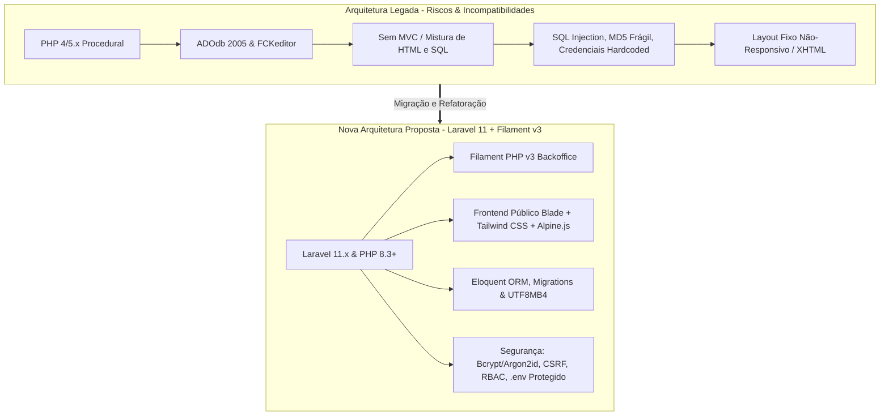
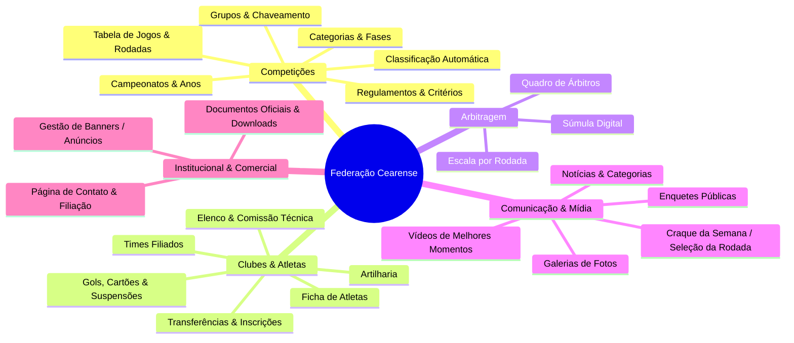
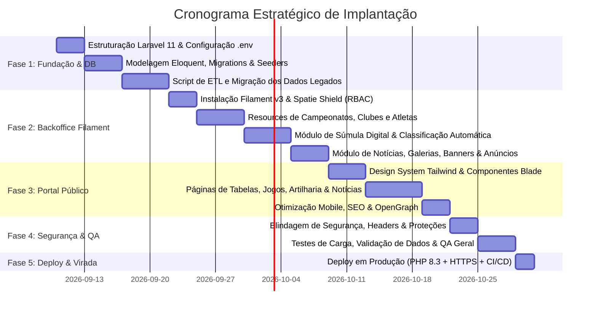

# ⚽ Planejamento Estratégico de Versão, Modernização e Segurança
## Sistema: [Federação Cearense (federacaocearense)](file:///c:/xampp/htdocs/federacaocearense)
## Proposta: Reestruturação Completa para Laravel 11.x, Filament PHP v3, PHP 8.3+ e Frontend Responsivo de Alta Performance

---

## 1. Sumário Executivo

O sistema atual da **Federação Cearense** ([federacaocearense](file:///c:/xampp/htdocs/federacaocearense)) é uma aplicação legada desenvolvida em **PHP procedural/estruturado (compatível com PHP 4/5.x)**, utilizando bibliotecas legadas (como ADOdb de 2005 e FCKeditor), sem frameworks modernos, sem separação de camadas MVC, e com severas vulnerabilidades de segurança, além de incompatibilidade crítica com as versões atuais do PHP (PHP 8.2+ no XAMPP e servidores de produção).

Este documento detalha o diagnóstico completo do sistema atual, mapeia as regras de negócio e os dados históricos, e apresenta o plano técnico estruturado para a **reconstrução, modernização, versionamento e blindagem de segurança** da plataforma.

---

## 2. Diagnóstico Técnico Situacional (AS-IS)

### 2.1. Vulnerabilidades Críticas de Segurança

| Risco / Vulnerabilidade | Descrição no Sistema Atual | Impacto |
| :--- | :--- | :--- |
| **SQL Injection Generalizado** | Consultas SQL interpoladas diretamente com parâmetros `GET`/`POST` sem `Prepared Statements` ou sanitização (ex: `class.usuario.php`, `class.campeonato.php`, `class.jogos.php`). | **Crítico**: Extração total do banco de dados, bypass de autenticação e destruição de tabelas. |
| **Credenciais Hardcoded** | O arquivo [lib/classes/config.php](file:///c:/xampp/htdocs/federacaocearense/lib/classes/config.php) expõe abertamente usuário e senha de banco de produção (`federacc_useling`). | **Crítico**: Comprometimento imediato da infraestrutura de banco de dados. |
| **Autenticação e Criptografia Obsoleta** | Autenticação com hash MD5 calculado no frontend via `md5.js` ([adm/login.php](file:///c:/xampp/htdocs/federacaocearense/adm/login.php)), sem `salts` e sem proteção contra força bruta. | **Alto**: Fácil quebra de senhas através de rainbow tables. |
| **Uploads Inseguros de Arquivos** | Upload de imagens e documentos salvos diretamente em diretórios web públicos (`banners/`, `imagem/`, `jogadores/`) sem validação de MIME type rigorosa. | **Crítico**: Risco de Remote Code Execution (RCE) via upload de scripts maliciosos `.php`. |
| **Ausência de CSRF e Rate Limiting** | Formulários e requisições AJAX (`ejax.js`) sem tokens de validação de origem e sem proteção contra requisições repetitivas. | **Alto**: Ações forçadas em nome de administradores autenticados e ataques de negação de serviço. |
| **Sessões Inseguras** | Controle de sessão simples via `session_start()` sem flags `HttpOnly`, `Secure` e `SameSite`, suscetível a *Session Hijacking*. | **Alto**: Roubo de sessão administrativa. |
| **Exposição de Arquivos Residuais** | Múltiplos arquivos de backup em produção (`indexx-bkp.php`, `index-BKP.php`, `login-BKP.php`, `.htaccess__`). | **Médio**: Exposição de código fonte e lógica interna para atacantes. |

### 2.2. Incompatibilidade de Linguagem e Bibliotecas
*   **PHP 8.2+ Broken**: Uso de propriedades de classe com palavra-chave `var`, sintaxe de arrays sem aspas (`id=>$rs->fields['id']`), chamadas de métodos dinâmicos descontinuados no PHP 8.
*   **Biblioteca ADOdb**: Versão arcaica (~2005) em [lib/adodb/](file:///c:/xampp/htdocs/federacaocearense/lib/adodb), incompatível com o driver moderno `mysqli` / `pdo_mysql` do PHP 8.
*   **FCKeditor**: Editor WYSIWYG obsoleto em [lib/fck/](file:///c:/xampp/htdocs/federacaocearense/lib/fck), descontinuado há mais de 15 anos e com histórico conhecido de vulnerabilidades.
*   **Conflito de Encodings**: Mistura de `charset=iso-8859-1` nos cabeçalhos HTML com `SET NAMES 'utf8'` no banco de dados, causando corrupção recorrente de acentuação em nomes de clubes, atletas e notícias.

### 2.3. Frontend e Experiência do Usuário
*   Layout baseado em dimensões fixas (960px/1024px) com XHTML 1.0, tabelas e frames.
*   Incompatibilidade com dispositivos móveis (smartphones e tablets), prejudicando o acesso de atletas, dirigentes e torcedores aos resultados e tabelas de jogos.
*   Baixa pontuação em Core Web Vitals, SEO e acessibilidade.

---

## 3. Mapeamento de Domínio e Regras de Negócio

O sistema atende à gestão de competições esportivas (Futebol 7, Society, Futsal/LCFS, Futebol de Campo, Futevôlei). Seus módulos estão divididos em:

---

## 4. Nova Arquitetura Proposta (TO-BE)

### 4.1. Stack Tecnológica Recomendada

*   **Backend**: **Laravel 11.x** (LTS/Atualizado) executando sob **PHP 8.3+**.
*   **Painel Administrativo**: **Filament PHP v3** (Livewire 3, Alpine.js, Tailwind CSS).
*   **Frontend Público**: **Blade Components + Tailwind CSS + Alpine.js** (Mobile-first, PWA-ready, tema Dark/Light premium).
*   **Banco de Dados**: **MySQL 8.0+ / MariaDB 10.11+** com charset `utf8mb4_unicode_ci`.
*   **Camada de Cache & Performance**: Cache de tabelas de classificação e páginas estáticas via **Redis** ou cache nativo de arquivos do Laravel.
*   **Armazenamento de Mídia**: **Spatie Media Library** com redimensionamento automático de fotos (WebP) e armazenamento isolado fora da raiz web pública.

### 4.2. Estrutura de Painéis no Filament PHP v3

```mermaid
graph LR
    subgraph Backoffice [Filament Admin Panel - /admin]
        direction TB
        Auth[Autenticação 2FA / Spatie Shield]
        MComp[Gestão de Campeonatos]
        MClubes[Gestão de Clubes & Atletas]
        MSumula[Súmula Digital & Placar]
        MMidia[Notícias, Fotos & Banners]
        MUsers[Controle de Usuários & Funções]
    end

    subgraph Portal [Frontend Público - /]
        direction TB
        Home[Home Dinâmica com Destaques]
        Tabelas[Tabelas & Classificação em Tempo Real]
        Jogos[Resultados, Próximas Rodadas & Súmulas]
        Artilharia[Artilharia & Estatísticas de Cartões]
        Noticias[Central de Notícias & Galerias]
        Institucional[Arbitragem, Regulamentos & Contato]
    end

    Backoffice -->|Alimenta dados via Eloquent| Database[(Banco MySQL 8)]
    Database -->|Renderização Rápida| Portal
```

---

## 5. Mapeamento de Entidades e Migração de Banco de Dados

### 5.1. Novas Tabelas e Models Eloquent (Normalizados)

| Tabela Legada | Novo Model Eloquent | Principais Campos & Relacionamentos |
| :--- | :--- | :--- |
| `campeonato` | `Championship` | `id`, `name`, `slug`, `year`, `category`, `status` (draft, ongoing, finished), `banner_url`, `rules_pdf`. |
| `grupos` | `Group` | `id`, `championship_id` (FK), `name` (Grupo A, B...), `phase` (Primeira Fase, Quartas...). |
| `times` | `Team` | `id`, `name`, `short_name`, `slug`, `badge_path` (escudo), `president`, `city`, `founded_at`, `status`. |
| `jogadores` | `Athlete` | `id`, `team_id` (FK), `name`, `nickname`, `cpf`, `rg`, `birth_date`, `photo_path`, `shirt_number`, `position`, `status`. |
| `jogos` | `GameMatch` | `id`, `championship_id` (FK), `group_id` (FK), `home_team_id` (FK), `away_team_id` (FK), `match_date`, `location`, `round_number`, `home_score`, `away_score`, `status` (scheduled, live, finished, postponed). |
| `classificacao` | `Standings` (View ou Tabela Calculada) | `team_id`, `championship_id`, `group_id`, `points`, `matches`, `wins`, `draws`, `losses`, `goals_for`, `goals_against`, `goal_difference`. |
| `jogadores_estatisticas` (Novo) | `MatchEvent` | `id`, `game_match_id` (FK), `athlete_id` (FK), `team_id` (FK), `event_type` (goal, yellow_card, red_card), `minute`. |
| `noticias`, `categoria_noticia` | `News`, `NewsCategory` | `id`, `category_id` (FK), `title`, `slug`, `summary`, `content`, `cover_image`, `published_at`, `is_featured`, `views_count`. |
| `galeria`, `galeria_fotos` | `Gallery`, `GalleryPhoto` | `id`, `title`, `event_date`, `cover_photo`, fotos via Spatie Media Library. |
| `banners` | `Banner` | `id`, `title`, `image_path`, `target_url`, `position` (header, sidebar, footer), `starts_at`, `expires_at`, `clicks_count`. |
| `usuarios` | `User` | `id`, `name`, `email`, `password` (Bcrypt), `role` (Super Admin, Editor, Mesário), `is_active`. |

---

## 6. Recursos e Telas Modernizadas (Filament v3)

### 6.1. Súmula Digital Interativa
Substituição da inserção manual de gols e cartões em telas separadas por um **Resource de Súmula Digital no Filament**:
*   Seleção dinâmica dos atletas escalados pelo clube mandante e visitante.
*   Adição de eventos (Gol, Cartão Amarelo, Cartão Vermelho) com 1 clique.
*   **Cálculo Automático da Tabela de Classificação**: ao finalizar a partida, a pontuação, saldo de gols e artilharia são atualizados instantaneamente no banco de dados.

### 6.2. Motor de Mídia e Otimização Automática
*   Upload de fotos e banners com conversão automática para formato **WebP**.
*   Geração automática de miniaturas (thumbnails) e tamanhos responsivos.
*   Editor Rich Text moderno integrado (TipTap / Quill) com suporte a embeds de vídeos do YouTube e redes sociais.

---

## 7. Plano de Implementação em 5 Fases

### Detalhamento das Fases:

#### **Fase 1: Fundação, Normalização de Dados e Infraestrutura**
1. Inicialização do projeto **Laravel 11.x** com PHP 8.3+.
2. Configuração de variáveis de ambiente seguras (`.env`) isoladas fora da raiz pública.
3. Criação das `Migrations` com integridade referencial (Foreign Keys, Índices, `utf8mb4`).
4. Desenvolvimento de script de ETL (Extract, Transform, Load) em PHP Artisan para migrar os registros de campeonatos, times, atletas, notícias e histórico de jogos do banco antigo para o novo formato.

#### **Fase 2: Painel Administrativo (Filament PHP v3)**
1. Configuração do Filament Panel com autenticação moderna, rate limiting e proteção contra ataques de força bruta.
2. Implementação do **Spatie Laravel Permission** para controle de perfis (Admin, Gestor de Torneios, Editor de Imprensa, Mesário).
3. Criação dos CRUDs reativos com filtros avançados, busca global e exportação para Excel/PDF.
4. Criação da tela de **Súmula Digital** com atualização automática da classificação geral e artilharia.

#### **Fase 3: Portal Público (Frontend Moderno & Mobile-First)**
1. Desenvolvimento de layout visual moderno utilizando Tailwind CSS e tema esportivo profissional.
2. Criação de componentes dinâmicos para:
   * Carrossel de destaques e últimas notícias.
   * Central de Jogos: Placar ao vivo / resultados da rodada.
   * Tabela de Classificação interativa com filtros por ano, campeonato e grupo.
   * Página de Atletas com estatísticas de gols e cartões.
   * Galeria de fotos com lightbox responsivo e compartilhamento em redes sociais.
3. Integração de metatags OpenGraph para compartilhamento de notícias e jogos no WhatsApp, Facebook e Instagram.

#### **Fase 4: Segurança, Auditoria e Testes**
1. Validação de políticas de Content Security Policy (CSP), HTTP Strict Transport Security (HSTS), X-Frame-Options e sanitização rigorosa via Laravel Middleware.
2. Implementação de backup automatizado do banco de dados e mídias via `spatie/laravel-backup`.
3. Execução de testes automatizados (Pest / PHPUnit) para regras críticas (cálculo de pontuação da tabela, critérios de desempate e registros de súmula).

#### **Fase 5: Deploy e Transição em Produção**
1. Configuração do servidor de produção (Nginx/Apache + PHP 8.3-FPM + MySQL 8 + SSL Certbot).
2. Configuração de rotinas de cron (`schedule:run`) e filas de processamento (`queue:work`).
3. Virada de DNS sem indisponibilidade e congelamento do banco antigo.

---

## 8. Matriz de Benefícios & Ganhos Estratégicos

| Aspecto | Sistema Legado (Atual) | Novo Sistema (Modernizado) |
| :--- | :--- | :--- |
| **Segurança** | Altamente vulnerável a invasões, SQL Injection e vazamento de dados. | Blindado com arquitetura Laravel, Bcrypt/Argon2id, CSRF, CSP e RBAC. |
| **Compatibilidade** | Bloqueado em versões obsoletas de PHP (PHP 5), trava no PHP 8.2+. | 100% compatível com PHP 8.3+ e arquitetura pronta para as próximas décadas. |
| **Mobile & Usabilidade** | Layout estático e quebrado em telas de smartphones. | Interface totalmente responsiva, fluida e adaptada para dispositivos móveis. |
| **Velocidade Operacional** | Lançamento manual e fragmentado de súmulas e classificação. | Súmula rápida com cálculo e publicação instantânea de tabelas e artilharia. |
| **Manutenibilidade** | Código procedural desordenado com mais de 6.000 arquivos e duplicações. | Arquitetura MVC limpa, modular, testável e de fácil manutenção por qualquer desenvolvedor. |
| **SEO & Divulgação** | Metas antigas, sem compartilhamento dinâmico em redes sociais. | Otimização para Google e cartões visuais para WhatsApp e Instagram. |
